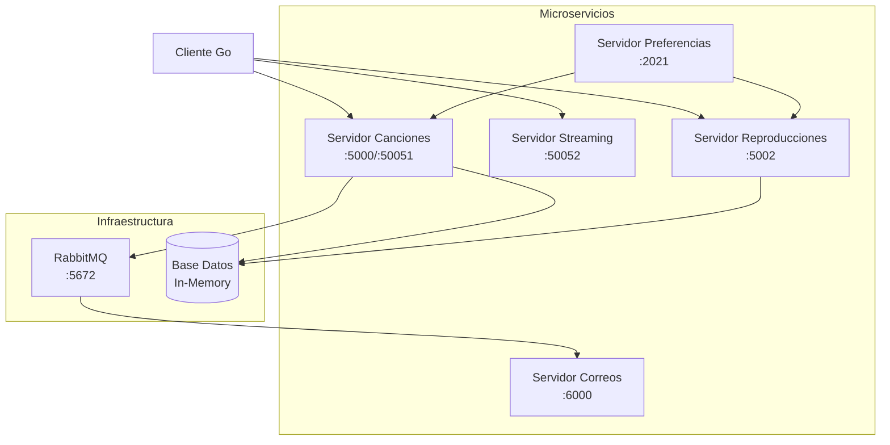

# 🎵 Spotify Pirata - Sistema de Microservicios

Sistema distribuido de streaming de música que simula las funcionalidades básicas de Spotify, implementado con arquitectura de microservicios utilizando **Go**, **Java Spring Boot**, **gRPC**, **REST APIs** y **RabbitMQ**.

## 📋 Descripción del Proyecto

**Spotify Pirata** es una plataforma de streaming musical distribuida que permite:
- 🎵 Almacenar y gestionar canciones
- 🎧 Streaming de audio en tiempo real
- 📊 Registro y análisis de reproducciones
- 🔍 Cálculo de preferencias musicales
- 📧 Notificaciones por correo (simuladas)
- 💻 Cliente de escritorio para interactuar con el sistema

## 🏗️ Arquitectura del Sistema



## 🧩 Componentes del Sistema

### 1. 🎵 **Servidor de Canciones** (`servidorCanciones/`)
- **Puerto REST**: 5000
- **Puerto gRPC**: 50051
- **Tecnología**: Go
- **Funcionalidades**:
  - Almacenamiento de canciones con metadatos
  - Gestión de catálogo musical
  - Publicación de eventos de nuevas canciones a RabbitMQ
  - API REST para operaciones CRUD

### 2. 🎧 **Servidor de Streaming** (`servidorStreaming/`)
- **Puerto gRPC**: 50052
- **Tecnología**: Go
- **Funcionalidades**:
  - Streaming de audio en tiempo real
  - Envío de fragmentos de audio por gRPC
  - Gestión de archivos de audio

### 3. 📊 **Servidor de Reproducciones** (`ServidorReproducciones/`)
- **Puerto**: 5002
- **Tecnología**: Go
- **Funcionalidades**:
  - Registro de reproducciones de usuarios
  - Historial de escucha
  - API REST para consulta de tendencias

### 4. 🔍 **Servidor de Preferencias** (`ServidorDePreferencias/`)
- **Puerto**: 2021
- **Tecnología**: Go
- **Funcionalidades**:
  - Cálculo de preferencias musicales por usuario
  - Análisis de patrones de escucha
  - Agregación de datos de múltiples fuentes

### 5. 📧 **Servidor de Correos** (`ServidorEnvioCorreos/`)
- **Puerto**: 6000
- **Tecnología**: Java Spring Boot
- **Funcionalidades**:
  - Consumo de mensajes de RabbitMQ
  - Simulación de envío de correos
  - Notificaciones de nuevas canciones

### 6. 💻 **Cliente de Escritorio** (`cliente/`)
- **Tecnología**: Go
- **Funcionalidades**:
  - Interfaz de línea de comandos
  - Autenticación de usuarios
  - Reproducción de música
  - Navegación del catálogo

## 🛠️ Tecnologías Utilizadas

| Componente | Tecnología | Protocolo | Puerto |
|------------|------------|-----------|--------|
| Servidor Canciones | Go | REST + gRPC | 5000, 50051 |
| Servidor Streaming | Go | gRPC | 50052 |
| Servidor Reproducciones | Go | REST | 5002 |
| Servidor Preferencias | Go | REST | 2021 |
| Servidor Correos | Java Spring Boot | RabbitMQ Consumer | 6000 |
| Cliente | Go | gRPC + REST | - |
| Message Broker | RabbitMQ | AMQP | 5672 |

## 🚀 Instalación y Configuración

### Prerrequisitos
- **Go** 1.18+ 
- **Java** 17+
- **Maven** 3.6+
- **RabbitMQ** 3.8+

### 1. Configurar RabbitMQ
```bash
# Iniciar servicio RabbitMQ (Windows)
rabbitmq-service start

# Verificar que esté ejecutándose en puerto 5672
# Usuario: admin, Contraseña: 1234
```

### 2. Ejecutar Microservicios

#### Servidor de Canciones
```bash
cd servidorCanciones/
go run vistas/servidor.go
```

#### Servidor de Streaming
```bash
cd servidorStreaming/
go run main/servidor.go
```

#### Servidor de Reproducciones
```bash
cd ServidorReproducciones/
go run main/main.go
```

#### Servidor de Preferencias
```bash
cd ServidorDePreferencias/
go run main/main.go
```

#### Servidor de Correos
```bash
cd ServidorEnvioCorreos/
mvn spring-boot:run
```

### 3. Ejecutar Cliente
```bash
cd cliente/
go run main/cliente.go
```

## 📡 APIs y Endpoints

### Servidor de Canciones
- `POST /canciones/almacenamiento` - Subir nueva canción
- `GET /canciones` - Listar catálogo de canciones

### Servidor de Reproducciones
- `POST /reproducciones` - Registrar reproducción
- `GET /reproducciones` - Obtener todas las reproducciones
- `GET /reproducciones?idUsuario=X` - Reproducciones por usuario

### Servidor de Preferencias
- `POST /preferencias/calcular` - Calcular preferencias de usuario

## 🧪 Pruebas con Postman

El proyecto incluye una colección de Postman (`Prueba/Prueba.postman_collection.json`) con las siguientes pruebas:

1. **Agregar Canción** - Sube una canción y dispara notificación por correo
2. **Agregar Reproducción** - Registra que un usuario reprodujo una canción
3. **Obtener Reproducciones** - Consulta el historial de reproducciones
4. **Obtener Reproducciones por Usuario** - Filtra por usuario específico

### Importar Colección
1. Abrir Postman
2. Import → File → Seleccionar `Prueba.postman_collection.json`
3. Ejecutar las peticiones en orden

## 🔄 Flujo de Comunicación

### Agregar Nueva Canción
```
Cliente → Servidor Canciones → RabbitMQ → Servidor Correos
```

### Reproducir Canción
```
Cliente → Servidor Streaming (audio) + Servidor Reproducciones (registro)
```

### Calcular Preferencias
```
Servidor Preferencias → Servidor Canciones + Servidor Reproducciones → Análisis
```

## 📊 Patrones de Diseño Implementados

- **Microservicios**: Cada servicio tiene una responsabilidad específica
- **API Gateway Pattern**: Cliente comunica con múltiples servicios
- **Event-Driven Architecture**: RabbitMQ para comunicación asíncrona
- **Repository Pattern**: Abstracción de acceso a datos
- **Facade Pattern**: Simplificación de interfaces complejas

## 🏗️ Estructura de Directorios

```
📁 Spotify Pirata/
├── 📁 cliente/                    # Cliente de escritorio en Go
├── 📁 servidorCanciones/         # Microservicio de gestión de canciones
├── 📁 servidorStreaming/         # Microservicio de streaming de audio
├── 📁 ServidorReproducciones/    # Microservicio de reproducciones
├── 📁 ServidorDePreferencias/    # Microservicio de análisis de preferencias
├── 📁 ServidorEnvioCorreos/      # Microservicio de notificaciones
├── 📁 Prueba/                    # Colección de Postman para testing
└── 📄 README.md                  # Este archivo
```

## 🔧 Configuración de Desarrollo

### Variables de Entorno (RabbitMQ)
```properties
# ServidorEnvioCorreos/src/main/resources/application.properties
spring.rabbitmq.host=localhost
spring.rabbitmq.port=5672
spring.rabbitmq.username=admin
spring.rabbitmq.password=1234
```

### Puertos por Defecto
- **Canciones REST**: 5000
- **Canciones gRPC**: 50051
- **Streaming gRPC**: 50052
- **Reproducciones**: 5002
- **Preferencias**: 2021
- **Correos**: 6000
- **RabbitMQ**: 5672

## 🎯 Casos de Uso Principales

1. **Subir Canción**: Usuario sube canción → Sistema notifica por correo
2. **Reproducir Música**: Usuario selecciona canción → Streaming + registro
3. **Ver Historial**: Usuario consulta sus reproducciones anteriores
4. **Analizar Gustos**: Sistema calcula preferencias basado en reproducciones

## 🚨 Solución de Problemas

### Puerto en Uso
```bash
# Verificar puertos ocupados
netstat -an | findstr "5000\|5002\|6000"
```

### RabbitMQ No Conecta
```bash
# Verificar estado del servicio
rabbitmq-service status
# Reiniciar si es necesario
rabbitmq-service restart
```

### Error de Compilación Go
```bash
# Limpiar módulos
go mod tidy
# Actualizar dependencias
go mod download
```

## 👥 Equipo de Desarrollo

- **Arquitectura**: Microservicios distribuidos
- **Backend**: Go + Java Spring Boot
- **Comunicación**: gRPC + REST + RabbitMQ
- **Testing**: Postman Collection

## 📝 Notas Importantes

- Los correos son **simulados** y se muestran en consola
- La base de datos es **en memoria** (se pierde al reiniciar)
- El sistema está diseñado para **desarrollo local**
- Todos los servicios deben estar ejecutándose para funcionalidad completa

---

**¡Disfruta explorando el mundo de Spotify Pirata! 🎵🏴‍☠️**